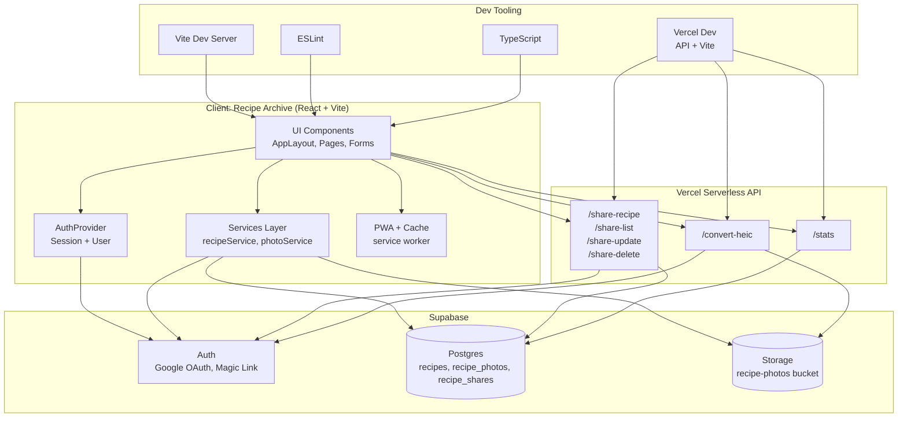

# Recipe Archive

Recipe Archive is a modern, full-featured recipe management application built with React, TypeScript, and Supabase. Store, organize, and manage your favorite recipes with photos, tags, and detailed cooking instructions.

## Features

- **Authentication**: Multiple authentication methods including email magic links and Google OAuth
- **Recipe Management**: Create, read, update, and delete recipes with full CRUD operations
- **Photo Support**: Upload and manage recipe photos with automatic HEIC/HEIF to JPEG conversion
- **Sharing**: Invite signed-in users to view or edit recipes in a shared cookbook view
- **Tagging System**: Organize recipes with custom tags and filter by them
- **Search**: Full-text search across recipe titles, descriptions, and tags
- **Progressive Web App (PWA)**: Installable on mobile and desktop with offline support
- **Modern UI**: Cinematic, responsive design with a focus on usability
- **Fast Performance**: Built with Vite for lightning-fast development and optimized builds

## Tech Stack

- **Frontend Framework**: React 19 with TypeScript
- **Build Tool**: Vite (Rolldown)
- **Routing**: React Router v7
- **Backend & Database**: Supabase (PostgreSQL + Storage)
- **Authentication**: Supabase Auth
- **PWA**: Vite PWA Plugin with Workbox
- **Serverless**: Vercel Functions for HEIC conversion, sharing, and landing-page stats
- **Image Processing**: heic-convert (server-side HEIC/HEIF conversion)
- **Code Quality**: ESLint with TypeScript support

## Prerequisites

Before you begin, ensure you have the following installed:

- **Node.js** (v18 or higher recommended)
- **npm** or **yarn** package manager
- **Supabase Account**: You'll need a Supabase project for backend services

## Getting Started

### 1. Clone the Repository

```bash
git clone <your-repo-url>
cd RecipeArchive
```
If your local folder name differs, adjust the `cd` command accordingly.

### 2. Install Dependencies

```bash
npm install
```

### 3. Set Up Supabase

1. Create a new project at [supabase.com](https://supabase.com)
2. Go to your project settings and get your:
   - Project URL
   - Anon (public) key
3. Enable Google OAuth (optional but recommended):
   - Navigate to Authentication > Providers in your Supabase dashboard
   - Enable the Google provider
   - Add your Google OAuth credentials (Client ID and Client Secret)
   - Add your site URL and redirect URLs in the Google provider settings

### 4. Configure Environment Variables

Create a `.env` file in the root directory:

```env
VITE_SUPABASE_URL=your_supabase_project_url
VITE_SUPABASE_ANON_KEY=your_supabase_anon_key
SUPABASE_SERVICE_ROLE_KEY=your_supabase_service_role_key
```
`SUPABASE_SERVICE_ROLE_KEY` is used by serverless endpoints only. Do not expose it to the client.

### 5. Set Up Database Schema

In your Supabase SQL Editor, run the following to create the necessary tables:

```sql
-- Recipes table
CREATE TABLE recipes (
  id UUID PRIMARY KEY DEFAULT gen_random_uuid(),
  user_id UUID NOT NULL REFERENCES auth.users(id) ON DELETE CASCADE,
  title TEXT NOT NULL,
  description TEXT,
  tags TEXT[] DEFAULT '{}',
  ingredients JSONB DEFAULT '[]',
  steps JSONB DEFAULT '[]',
  prep_minutes INTEGER,
  cook_minutes INTEGER,
  servings INTEGER,
  source_url TEXT,
  cover_photo_id UUID,
  created_at TIMESTAMPTZ DEFAULT NOW(),
  updated_at TIMESTAMPTZ DEFAULT NOW()
);

-- Recipe photos table
CREATE TABLE recipe_photos (
  id UUID PRIMARY KEY DEFAULT gen_random_uuid(),
  user_id UUID NOT NULL REFERENCES auth.users(id) ON DELETE CASCADE,
  recipe_id UUID NOT NULL REFERENCES recipes(id) ON DELETE CASCADE,
  storage_path TEXT NOT NULL,
  created_at TIMESTAMPTZ DEFAULT NOW()
);

-- Enable Row Level Security
ALTER TABLE recipes ENABLE ROW LEVEL SECURITY;
ALTER TABLE recipe_photos ENABLE ROW LEVEL SECURITY;
-- New: shared recipes
CREATE TYPE share_permission AS ENUM ('view', 'edit');
CREATE TYPE group_role AS ENUM ('owner', 'admin', 'member');
CREATE TYPE group_member_status AS ENUM ('pending', 'accepted', 'declined');

CREATE TABLE recipe_shares (
  id UUID PRIMARY KEY DEFAULT gen_random_uuid(),
  recipe_id UUID NOT NULL REFERENCES recipes(id) ON DELETE CASCADE,
  owner_id UUID NOT NULL REFERENCES auth.users(id) ON DELETE CASCADE,
  shared_with UUID NOT NULL REFERENCES auth.users(id) ON DELETE CASCADE,
  permission share_permission NOT NULL DEFAULT 'view',
  created_at TIMESTAMPTZ DEFAULT NOW(),
  UNIQUE (recipe_id, shared_with)
);

CREATE TABLE groups (
  id UUID PRIMARY KEY DEFAULT gen_random_uuid(),
  name TEXT NOT NULL,
  owner_id UUID NOT NULL REFERENCES auth.users(id) ON DELETE CASCADE,
  created_at TIMESTAMPTZ DEFAULT NOW()
);

CREATE TABLE group_members (
  id UUID PRIMARY KEY DEFAULT gen_random_uuid(),
  group_id UUID NOT NULL REFERENCES groups(id) ON DELETE CASCADE,
  user_id UUID NOT NULL REFERENCES auth.users(id) ON DELETE CASCADE,
  role group_role NOT NULL DEFAULT 'member',
  status group_member_status NOT NULL DEFAULT 'pending',
  invited_by UUID REFERENCES auth.users(id) ON DELETE SET NULL,
  created_at TIMESTAMPTZ DEFAULT NOW(),
  UNIQUE (group_id, user_id)
);

CREATE TABLE recipe_group_shares (
  id UUID PRIMARY KEY DEFAULT gen_random_uuid(),
  recipe_id UUID NOT NULL REFERENCES recipes(id) ON DELETE CASCADE,
  group_id UUID NOT NULL REFERENCES groups(id) ON DELETE CASCADE,
  owner_id UUID NOT NULL REFERENCES auth.users(id) ON DELETE CASCADE,
  permission share_permission NOT NULL DEFAULT 'view',
  created_at TIMESTAMPTZ DEFAULT NOW(),
  UNIQUE (recipe_id, group_id)
);

ALTER TABLE recipe_shares ENABLE ROW LEVEL SECURITY;
ALTER TABLE groups ENABLE ROW LEVEL SECURITY;
ALTER TABLE group_members ENABLE ROW LEVEL SECURITY;
ALTER TABLE recipe_group_shares ENABLE ROW LEVEL SECURITY;

-- RLS Policies for recipes
CREATE POLICY "Users can view their own recipes"
  ON recipes FOR SELECT
  USING (auth.uid() = user_id);

CREATE POLICY "Users can insert their own recipes"
  ON recipes FOR INSERT
  WITH CHECK (auth.uid() = user_id);

CREATE POLICY "Users can update their own recipes"
  ON recipes FOR UPDATE
  USING (auth.uid() = user_id);

CREATE POLICY "Users can delete their own recipes"
  ON recipes FOR DELETE
  USING (auth.uid() = user_id);

CREATE POLICY "Shared users can view recipes"
  ON recipes FOR SELECT
  USING (EXISTS (
    SELECT 1 FROM recipe_shares s
    WHERE s.recipe_id = recipes.id
      AND s.shared_with = auth.uid()
  ) OR EXISTS (
    SELECT 1
    FROM recipe_group_shares gs
    JOIN group_members gm ON gm.group_id = gs.group_id
    WHERE gs.recipe_id = recipes.id
      AND gm.user_id = auth.uid()
      AND gm.status = 'accepted'
  ));

CREATE POLICY "Shared users can edit recipes"
  ON recipes FOR UPDATE
  USING (EXISTS (
    SELECT 1 FROM recipe_shares s
    WHERE s.recipe_id = recipes.id
      AND s.shared_with = auth.uid()
      AND s.permission = 'edit'
  ) OR EXISTS (
    SELECT 1
    FROM recipe_group_shares gs
    JOIN group_members gm ON gm.group_id = gs.group_id
    WHERE gs.recipe_id = recipes.id
      AND gm.user_id = auth.uid()
      AND gm.status = 'accepted'
      AND gs.permission = 'edit'
  ));

-- RLS Policies for recipe_photos
CREATE POLICY "Users can view their own photos"
  ON recipe_photos FOR SELECT
  USING (auth.uid() = user_id);

CREATE POLICY "Users can insert their own photos"
  ON recipe_photos FOR INSERT
  WITH CHECK (auth.uid() = user_id);

CREATE POLICY "Users can delete their own photos"
  ON recipe_photos FOR DELETE
  USING (auth.uid() = user_id);

CREATE POLICY "Shared users can view photos"
  ON recipe_photos FOR SELECT
  USING (EXISTS (
    SELECT 1 FROM recipe_shares s
    WHERE s.recipe_id = recipe_photos.recipe_id
      AND s.shared_with = auth.uid()
  ) OR EXISTS (
    SELECT 1
    FROM recipe_group_shares gs
    JOIN group_members gm ON gm.group_id = gs.group_id
    WHERE gs.recipe_id = recipe_photos.recipe_id
      AND gm.user_id = auth.uid()
      AND gm.status = 'accepted'
  ));

CREATE POLICY "Owners can manage shares"
  ON recipe_shares FOR ALL
  USING (auth.uid() = owner_id)
  WITH CHECK (auth.uid() = owner_id);

CREATE POLICY "Shared users can view shares"
  ON recipe_shares FOR SELECT
  USING (auth.uid() = shared_with);

CREATE POLICY "Users can view their groups"
  ON groups FOR SELECT
  USING (EXISTS (
    SELECT 1 FROM group_members gm
    WHERE gm.group_id = groups.id
      AND gm.user_id = auth.uid()
      AND gm.status IN ('accepted', 'pending')
  ));

CREATE POLICY "Owners can manage groups"
  ON groups FOR UPDATE
  USING (auth.uid() = owner_id)
  WITH CHECK (auth.uid() = owner_id);

CREATE POLICY "Owners can delete groups"
  ON groups FOR DELETE
  USING (auth.uid() = owner_id);

CREATE POLICY "Members can view group members"
  ON group_members FOR SELECT
  USING (
    auth.uid() = user_id OR EXISTS (
      SELECT 1 FROM group_members gm
      WHERE gm.group_id = group_members.group_id
        AND gm.user_id = auth.uid()
        AND gm.status = 'accepted'
    )
  );

CREATE POLICY "Members can respond to invites"
  ON group_members FOR UPDATE
  USING (auth.uid() = user_id AND status = 'pending')
  WITH CHECK (auth.uid() = user_id);

CREATE POLICY "Admins can manage members"
  ON group_members FOR UPDATE
  USING (EXISTS (
    SELECT 1 FROM group_members gm
    WHERE gm.group_id = group_members.group_id
      AND gm.user_id = auth.uid()
      AND gm.status = 'accepted'
      AND gm.role IN ('owner', 'admin')
  ));

CREATE POLICY "Admins can remove members"
  ON group_members FOR DELETE
  USING (EXISTS (
    SELECT 1 FROM group_members gm
    WHERE gm.group_id = group_members.group_id
      AND gm.user_id = auth.uid()
      AND gm.status = 'accepted'
      AND gm.role IN ('owner', 'admin')
  ));

CREATE POLICY "Members can view group shares"
  ON recipe_group_shares FOR SELECT
  USING (EXISTS (
    SELECT 1 FROM group_members gm
    WHERE gm.group_id = recipe_group_shares.group_id
      AND gm.user_id = auth.uid()
      AND gm.status = 'accepted'
  ));

CREATE POLICY "Owners can manage group shares"
  ON recipe_group_shares FOR ALL
  USING (auth.uid() = owner_id)
  WITH CHECK (auth.uid() = owner_id);
```

### 6. Set Up Storage Bucket

1. Go to Storage in your Supabase dashboard
2. Create a new bucket named `recipe-photos`
3. Make it **private** (not public)
4. Add the following policy:

```sql
CREATE POLICY "Users can upload their own photos"
  ON storage.objects FOR INSERT
  WITH CHECK (
    bucket_id = 'recipe-photos' AND
    auth.uid()::text = (storage.foldername(name))[1]
  );

CREATE POLICY "Users can view their own photos"
  ON storage.objects FOR SELECT
  USING (
    bucket_id = 'recipe-photos' AND
    auth.uid()::text = (storage.foldername(name))[1]
  );

CREATE POLICY "Shared users can view shared photos"
  ON storage.objects FOR SELECT
  USING (
    bucket_id = 'recipe-photos' AND (
      EXISTS (
        SELECT 1
        FROM recipe_shares s
        WHERE s.recipe_id::text = (storage.foldername(name))[2]
          AND s.shared_with = auth.uid()
      )
      OR EXISTS (
        SELECT 1
        FROM recipe_group_shares gs
        JOIN group_members gm ON gm.group_id = gs.group_id
        WHERE gs.recipe_id::text = (storage.foldername(name))[2]
          AND gm.user_id = auth.uid()
          AND gm.status = 'accepted'
      )
    )
  );

CREATE POLICY "Users can delete their own photos"
  ON storage.objects FOR DELETE
  USING (
    bucket_id = 'recipe-photos' AND
    auth.uid()::text = (storage.foldername(name))[1]
  );
```

### 7. Configure Google OAuth (Optional)

If you want to enable Google authentication:

1. Go to [Google Cloud Console](https://console.cloud.google.com/)
2. Create a new project or select an existing one
3. Enable the Google+ API
4. Create OAuth 2.0 credentials:
   - Go to APIs & Services > Credentials
   - Click "Create Credentials" > "OAuth client ID"
   - Choose "Web application"
   - Add authorized redirect URIs:
     - `https://<your-supabase-project-ref>.supabase.co/auth/v1/callback`
     - For local development: `http://localhost:5173` (or your dev port)
   - Copy the Client ID and Client Secret
5. In Supabase dashboard, go to Authentication > Providers > Google:
   - Enable the provider
   - Paste your Client ID and Client Secret
   - Save the changes

### 8. Run the Development Server

```bash
vercel dev
```

`vercel dev` runs the Vite frontend and the serverless API routes together. The app will be available at `http://localhost:5173` (or the port shown in your terminal).

## Project Structure

```
RecipeArchive/
├── src/
│   ├── auth/              # Authentication components
│   │   ├── AuthProvider.tsx
│   │   └── ProtectedRoute.tsx
│   ├── lib/               # Core services and utilities
│   │   ├── supabaseClient.ts
│   │   ├── recipeService.ts
│   │   ├── photoService.ts
│   │   └── types.ts
│   ├── pages/             # Page components
│   │   ├── LoginPage.tsx
│   │   ├── RecipeListPage.tsx
│   │   ├── RecipeDetailPage.tsx
│   │   ├── RecipeNewPage.tsx
│   │   └── RecipeEditPage.tsx
│   ├── ui/                # Reusable UI components
│   │   ├── AppLayout.tsx
│   │   ├── RecipeCard.tsx
│   │   ├── RecipeForm.tsx
│   │   ├── PhotoUploader.tsx
│   │   └── TagFilter.tsx
│   ├── App.tsx            # Main app component
│   ├── main.tsx           # Application entry point
│   ├── pwa.ts             # PWA initialization
│   └── index.css          # Global styles
├── public/                # Static assets
├── dist/                  # Build output
├── vite.config.ts         # Vite configuration
├── tsconfig.json          # TypeScript configuration
└── package.json           # Dependencies and scripts
```

## Architecture Diagram



## Key Features Explained

### Authentication
- **Email Magic Links**: Passwordless email-based authentication - users receive a secure link to sign in
- **Google OAuth**: One-click sign-in with Google accounts for faster authentication
- Secure session management with Supabase Auth
- Protected routes that require authentication

### Recipe Management
- **Create**: Add new recipes with title, description, ingredients, steps, and metadata
- **Read**: View recipe details with photos and all information
- **Update**: Edit existing recipes
- **Delete**: Remove recipes (cascades to photos)

### Photo Management
- Upload multiple photos per recipe
- Automatic HEIC/HEIF to JPEG conversion for iOS compatibility
- Private storage with signed URLs for secure access
- Set cover photos for recipe cards

### Search & Filter
- Real-time search across titles, descriptions, and tags
- Filter by multiple tags simultaneously
- Clear visual feedback for active filters

### Progressive Web App
- Installable on mobile and desktop
- Offline support with service workers
- Auto-updating when new versions are available

## Available Scripts

- `vercel dev` - Run Vite + serverless API routes together (recommended for local)
- `npm run dev` - Start Vite dev server only (no `/api` routes)
- `npm run build` - Build for production (outputs to `dist/`)
- `npm run preview` - Preview production build locally
- `npm run lint` - Run ESLint to check code quality

## Deployment

### Vercel (Recommended)

1. Push your code to GitHub
2. Import your repository in Vercel
3. Add environment variables:
   - `VITE_SUPABASE_URL`
   - `VITE_SUPABASE_ANON_KEY`
   - `SUPABASE_SERVICE_ROLE_KEY`
4. Deploy!

### Other Platforms

The app can be deployed to any static hosting service:
- **Netlify**: Connect your repo and add environment variables
- **GitHub Pages**: Use GitHub Actions to build and deploy
- **Cloudflare Pages**: Connect repo and configure build settings

**Important**: Update the redirect URLs in `LoginPage.tsx` to your production URL:

```typescript
// For email magic links
emailRedirectTo: 'https://your-production-url.com'

// For Google OAuth
redirectTo: 'https://your-production-url.com'
```

Also ensure your Supabase project has the production URL added to:
- Authentication > URL Configuration > Site URL
- Authentication > Providers > Google > Redirect URLs (if using Google OAuth)

## Security Notes

- All data is protected by Row Level Security (RLS) policies
- Users can only access their own recipes and photos
- Photos are stored in private buckets with signed URLs
- Authentication tokens are managed securely by Supabase

## Troubleshooting

### "Missing VITE_SUPABASE_URL or VITE_SUPABASE_ANON_KEY"
- Ensure your `.env` file exists in the root directory
- Check that variable names are correct (must start with `VITE_`)
- Restart the dev server after adding environment variables

### Photos not uploading
- Verify the `recipe-photos` bucket exists in Supabase
- Check that storage policies are correctly configured
- Ensure the bucket is set to private
- If uploading HEIC, confirm the `/api/convert-heic` function is deployed and `SUPABASE_SERVICE_ROLE_KEY` is set

### Authentication not working
- Verify your Supabase project URL and anon key are correct
- Check Supabase Auth settings (email templates, redirect URLs)
- Ensure email redirect URL matches your deployment URL
- For Google OAuth: Verify Google OAuth credentials are correctly configured in Supabase
- For Google OAuth: Ensure redirect URLs are added in both Google Cloud Console and Supabase dashboard

## Contributing

Contributions are welcome! Please feel free to submit a Pull Request.

1. Fork the repository
2. Create your feature branch (`git checkout -b feature/AmazingFeature`)
3. Commit your changes (`git commit -m 'Add some AmazingFeature'`)
4. Push to the branch (`git push origin feature/AmazingFeature`)
5. Open a Pull Request

## License

This project is open source and available under the [MIT License](LICENSE).

## Acknowledgments

- Built with [React](https://react.dev/)
- Powered by [Supabase](https://supabase.com/)
- Styled with modern CSS
- Icons and assets from various open-source projects

---

Made for food lovers everywhere
